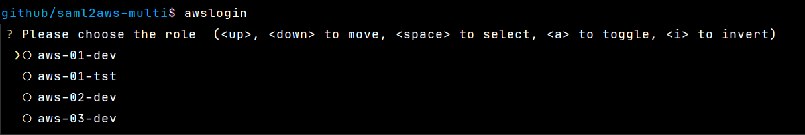

# saml2aws-multi

[](https://github.com/kyhau/saml2aws-multi/actions)
[](https://codecov.io/gh/kyhau/saml2aws-multi)
[](http://en.wikipedia.org/wiki/MIT_License)

This is a helper script providing an easy-to-use command line interface to support login and retrieve AWS temporary credentials for multiple roles of different accounts with [saml2aws](https://github.com/Versent/saml2aws).


Support Python >= 3.7

## Usage

```
$ awslogin --help
Usage: awslogin [OPTIONS] COMMAND [ARGS]...

  Get credentials for multiple accounts with saml2aws

Options:
  -l, --shortlisted TEXT          Show only roles with the given keyword(s);
                                  e.g. -l keyword1 -l keyword2...

  -s, --pre-select TEXT           Pre-select roles with the given keyword(s);
                                  e.g. -s keyword1 -s keyword2...

  -n, --profile-name-format [RoleName|RoleName-AccountAlias]
                                  Set the profile name format.  [default:
                                  RoleName]

  -r, --refresh-cached-roles      Re-retrieve the roles associated to the
                                  username and password you providedand save
                                  the roles into <home>/.saml2aws-
                                  multi/aws_login_roles.csv.  [default: False]

  -t, --session-duration TEXT     Set the session duration in seconds,
  -d, --debug                     Enable debug mode.  [default: False]
  --help                          Show this message and exit.

Commands:
  chained  List chained role profiles specified in ~/.aws/config
  switch   Switch default profile
  whoami   Who am I?
```

### Usage Examples

1. When you run `awslogin` the first time, the script retrieves the roles associated to the username and password you provided, then saves the roles to `<user_home>/.saml2aws-multi/aws_login_roles.csv`, such that the script does not need to call `list_roles` every time you run `awslogin`.

    For example, if you have role ARNs like:
    ```
    RoleArn, AccountAlias
    arn:aws:iam::123456789012:role/aws-01-dev, aws-01
    arn:aws:iam::123456789012:role/aws-01-tst, aws-01
    arn:aws:iam::213456789012:role/aws-02-dev, aws-02
    arn:aws:iam::313456789012:role/aws-03-dev, aws-03
    ```
    Then, the profile names will look like
    

    To refresh the content of `aws_login_roles.csv`, just run

    ```
    awslogin --refresh-cached-roles
    ```

2. When you run `awslogin`, the script pre-selects the options you selected last time.

    

3. Use `--pre-select` or `-s` to pre-select option by keyword(s).

    ```
    awslogin -s dev -s tst
    ```

4. Use `--shortlisted` or `-l` to show the list of roles having profile name matching the given keyword(s).

    ```
    awslogin -l dev -l tst
    ```

5. To change your `default` profile in `<user_home>/.aws/credentials`, run

    ```
    awslogin switch
    ```

6. If you have roles in different accounts with the same role names, you can use `--profile-name-format RoleName-AccountAlias`, such that the profile names will include both role name and account alias.  Alternatively, you can also change `DEFAULT_PROFILE_NAME_FORMAT` in the code to `RoleName-AccountAlias`.

    For example, if you have role ARNs like:
    ```
    RoleArn, AccountAlias
    arn:aws:iam::123456789012:role/dev, aws-01
    arn:aws:iam::123456789012:role/tst, aws-01
    arn:aws:iam::213456789012:role/dev, aws-02
    arn:aws:iam::313456789012:role/dev, aws-03
    ```
    Then, the profile names will look like
    


## Build and Run

1. Install [saml2aws](https://github.com/Versent/saml2aws). See also
   [install_saml2aws.sh](install_saml2aws.sh) for Linux, or
   [Install-saml2aws.ps1](Install-saml2aws.ps1) for Windows.

2. Create `saml2aws` config file (`~/.saml2aws`) by running `saml2aws configure`.

3. Build and run
```
virtualenv env
. env/bin/activate      # (or env\Scripts\activate on Windows)
pip install -e .
awslogin --help
```

## Tox Tests and Build the Wheels

```
pip install -r requirements-build.txt
tox -r
```
