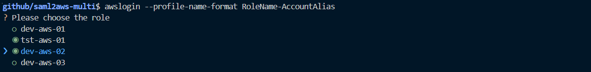

# saml2aws-multi

[](https://github.com/kyhau/saml2aws-multi/actions/workflows/ci.yml)
[](https://codecov.io/gh/kyhau/saml2aws-multi)
[](https://github.com/kyhau/saml2aws-multi/actions/workflows/codeql-analysis.yml)
[](https://github.com/kyhau/saml2aws-multi/actions/workflows/snyk.yml)
[](https://github.com/kyhau/saml2aws-multi/actions/workflows/secrets-scan.yml)


[](http://en.wikipedia.org/wiki/MIT_License)

A helper script providing an easy-to-use command line interface to login and retrieve AWS temporary credentials for multiple roles across different accounts using [saml2aws](https://github.com/Versent/saml2aws).


All notable changes to this project will be documented in [CHANGELOG](./CHANGELOG.md).

**Supports Python 3.10, 3.11, 3.12, 3.13**

## ✨ Features

### 🔧 Development Tools
- **[Poetry](https://python-poetry.org/)** - Modern dependency management
- **[Makefile](Makefile)** - Convenient command shortcuts for common tasks
- **[pytest](https://pytest.org/)** - Testing framework with coverage reporting
- **[black](https://black.readthedocs.io/)** - Code formatting
- **[flake8](https://flake8.pycqa.org/)** - Python code linting

### 🔐 Security & Code Quality
- **[CodeQL](https://codeql.github.com)** - Automated security analysis ([workflow](.github/workflows/codeql-analysis.yml))
- **[Secrets Scan](https://github.com/gitleaks/gitleaks)** - Gitleaks and TruffleHog for detecting hardcoded secrets ([workflow](.github/workflows/secrets-scan.yml))
- **[Snyk](https://snyk.io/)** - Vulnerability scanning ([workflow](.github/workflows/snyk.yml))
- **[Dependabot](https://docs.github.com/en/code-security/dependabot)** - Automated dependency updates ([config](.github/dependabot.yml))

### 🚀 CI/CD
- **[GitHub Actions](https://github.com/features/actions)** - Automated testing across Python 3.10-3.13
- **[Codecov](https://codecov.io/)** - Code coverage reporting
- **Stale Issue Management** - Automatically closes inactive issues

---
## Usage

```
$ awslogin --help
Usage: awslogin [OPTIONS] COMMAND [ARGS]...

  Get credentials for multiple accounts with saml2aws

Options:
  -l, --shortlisted TEXT          Show only roles with the given keyword(s);
                                  e.g. -l keyword1 -l keyword2...

  -s, --pre-select TEXT           Pre-select roles with the given keyword(s);
                                  e.g. -s keyword1 -s keyword2...

  -n, --profile-name-format [RoleName|RoleName-AccountAlias]
                                  Set the profile name format.  [default:
                                  RoleName]

  -r, --refresh-cached-roles      Re-retrieve the roles associated to the
                                  username and password you providedand save
                                  the roles into <home>/.saml2aws-
                                  multi/aws_login_roles.csv.  [default: False]

  -t, --session-duration TEXT     Set the session duration in seconds,
  -b, --browser-autofill          Enable browser-autofill.
  -d, --debug                     Enable debug mode.  [default: False]
  --help                          Show this message and exit.

Commands:
  chained  List chained role profiles specified in ~/.aws/config
  switch   Switch default profile
  whoami   Who am I?
```

### Usage Examples

1. When you run `awslogin` the first time, the script retrieves the roles associated to the username and password you provided, then saves the roles to `<user_home>/.saml2aws-multi/aws_login_roles.csv`, such that the script does not need to call `list_roles` every time you run `awslogin`.

    For example, if you have role ARNs like:
    ```
    RoleArn, AccountAlias
    arn:aws:iam::123456789012:role/aws-01-dev, aws-01
    arn:aws:iam::123456789012:role/aws-01-tst, aws-01
    arn:aws:iam::213456789012:role/aws-02-dev, aws-02
    arn:aws:iam::313456789012:role/aws-03-dev, aws-03
    ```
    Then, the profile names will look like
    

    To refresh the content of `aws_login_roles.csv`, just run

    ```
    awslogin --refresh-cached-roles
    ```

2. When you run `awslogin`, the script pre-selects the options you selected last time.

    

3. Use `--pre-select` or `-s` to pre-select option by keyword(s).

    ```
    awslogin -s dev -s tst
    ```

4. Use `--shortlisted` or `-l` to show the list of roles having profile name matching the given keyword(s).

    ```
    awslogin -l dev -l tst
    ```

5. To change your `default` profile in `<user_home>/.aws/credentials`, run

    ```
    awslogin switch
    ```

6. If you have roles in different accounts with the same role names, you can use `--profile-name-format RoleName-AccountAlias`, such that the profile names will include both role name and account alias.  Alternatively, you can also change `DEFAULT_PROFILE_NAME_FORMAT` in the code to `RoleName-AccountAlias`.

    For example, if you have role ARNs like:
    ```
    RoleArn, AccountAlias
    arn:aws:iam::123456789012:role/dev, aws-01
    arn:aws:iam::123456789012:role/tst, aws-01
    arn:aws:iam::213456789012:role/dev, aws-02
    arn:aws:iam::313456789012:role/dev, aws-03
    ```
    Then, the profile names will look like
    

---
## 🚀 Installation

### Prerequisites

Before installing, ensure you have:

1. **Python 3.10+** installed
2. **[saml2aws](https://github.com/Versent/saml2aws)** installed
   - See [install-saml2aws.sh](install-saml2aws.sh) for a Linux installation script
   - For other platforms, follow the [official installation guide](https://github.com/Versent/saml2aws#install)
3. **saml2aws config file** (`~/.saml2aws`) - Run `saml2aws configure` to create

### Installation Options

Choose the installation method that best fits your use case:

#### Option 1: pipx (Recommended for end users)

[pipx](https://pipx.pypa.io/) installs the CLI in an isolated environment while making it globally available:

```bash
# Install pipx if needed
pip install pipx

# Install saml2awsmulti
pipx install .

# Run from anywhere
awslogin --help
awslogin
```

#### Option 2: pip (Simple installation)

```bash
# Install directly with pip
pip install .

# Run the CLI
awslogin --help
awslogin
```

#### Option 3: Development Installation

For contributing or development work:

```bash
# Quick setup (recommended for first-time setup)
make setup-init

# Manual setup (alternative)
make setup-venv    # Configure Poetry virtualenv
make install-all   # Install all dependencies

# Run with Poetry
poetry run awslogin --help
poetry run awslogin

# Or activate the virtualenv
poetry shell
awslogin

# View all available commands
make help
```

## 📋 Development Workflow

### Common Commands

```bash
make setup-init         # First-time setup (configure, lock, install everything)
make help               # Show all available commands
make install-all        # Install all dependencies (main, dev, test)
make test               # Run tests without coverage
make test-with-coverage # Run tests with coverage
make format-python      # Auto-format Python code
make lint-python        # Lint Python code
make lint-yaml          # Lint YAML files
make pre-commit         # Run all quality checks (format, lint, test)
make build              # Build the package
make clean              # Clean build artifacts
```

### Running Tests

```bash
# Run tests with coverage
make test-with-coverage

# Run tests only
make test

# Format and lint code
make format-python
make lint-python
make lint-yaml

# Run all quality checks before committing
make pre-commit
```

### Managing Dependencies

```bash
# Update dependencies to latest compatible versions
make update-deps

# Regenerate lock file
make lock
```

## 🏗️ Project Structure

```
saml2aws-multi/
├── .github/
│   ├── workflows/        # CI/CD workflows
│   └── dependabot.yml    # Dependency updates config
├── saml2awsmulti/        # Main Python package
│   ├── __init__.py
│   ├── aws_login.py      # Main CLI logic
│   ├── file_io.py
│   ├── saml2aws_helper.py
│   └── selector.py
├── tests/                # Unit tests
│   ├── test_aws_login.py
│   ├── test_file_io.py
│   ├── test_saml2aws_helper.py
│   └── test_selector.py
├── pyproject.toml        # Project metadata and dependencies
├── Makefile              # Build and test commands
├── CHANGELOG.md          # Version history and changes
├── CODE_OF_CONDUCT.md    # Community guidelines
├── CONTRIBUTING.md       # Contribution guidelines
├── SECURITY.md           # Security policy
└── README.md             # This file
```

## 🤝 Contributing

Contributions are welcome! Please see:
- [CONTRIBUTING.md](CONTRIBUTING.md) - Contribution guidelines
- [CODE_OF_CONDUCT.md](CODE_OF_CONDUCT.md) - Community standards

## 🔒 Security

For security issues, please see [SECURITY.md](SECURITY.md) for our security policy and reporting guidelines.
